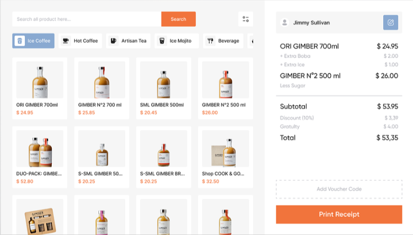
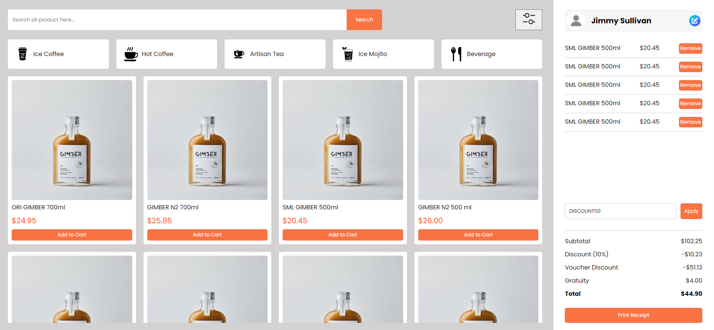

## Introduction
This is a company assignment given by Karkhana.io for the fronted role we have to clone the given image with add-to-cart functionality and many more...

## Assignment 

## Project Type
Frontend 

## Deployed App
karkhana-assignment-olive.vercel.app/

# Screenshots of the assignment

## Directory Structure
Karkhana-Assignment/ 
├── public/ 
│ ├── vite.svg 
├── src/ 
│ ├── assets/ 
│ │ ├── artisan.png 
│ │ ├── assignment.png 
│ │ ├── assignment1.png 
│ │ ├── beverage.png 
│ │ ├── artisan.png 
│ │ ├── compose.png 
│ │ ├── filter.png 
│ │ ├── hotTea.png 
│ │ ├── mojito.png 
│ │ ├── pen.png 
│ │ ├── Image2.png 
│ │ └── ... 
│ ├── components/ 
│ │ ├── Cart.jsx 
│ │ ├── Filters.jsx 
│ │ ├── ProductList.jsx 
│ │ ├── SearchBar.jsx 
│ │ ├── Summary.jsx 
│ │ ├── Profile.jsx 
│ │ ├── Voucher.jsx 
│ │ └── ... 
│ ├── css/ 
│ │ ├── Cart.css 
│ │ ├── Filters.css 
│ │ ├── ProductList.css 
│ │ ├── SearchBar.css 
│ │ ├── Summary.css 
│ │ ├── Profile.css 
│ │ ├── Voucher.css 
│ │ └── ... 
│ ├── App.css 
│ ├── App.jsx 
│ ├── index.css 
│ └── ... 
├── .eslintrc.cjs 
├── .gitignore 
├── package.json 
├── README.md 
├── .index.html 
└── ... 

## Features
List out the key features of your application.
- add to cart functionality
- remove products from the cart
- Responsive for all screen Size

## Tech Stack
List and provide a brief overview of the technologies used in the project.
- HTML
- CSS
- Javascript
- React
